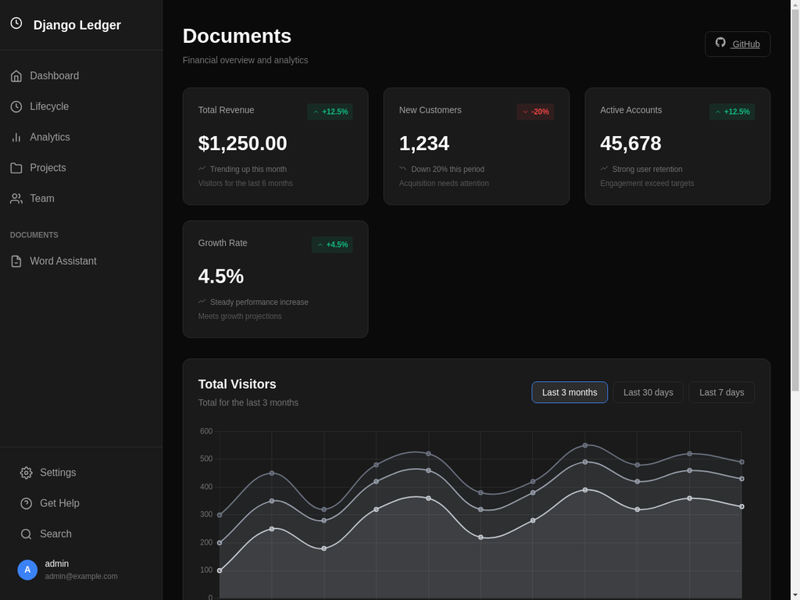
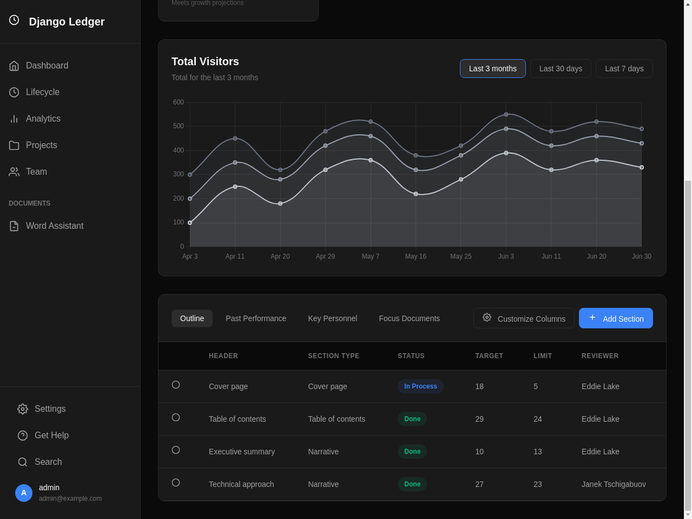

# Django Ledger - Dark Theme (shadcn/ui Style)

A modern dark theme redesign of Django Ledger inspired by shadcn/ui design blocks.

## 🎨 Features

- **Dark Theme**: Beautiful dark color scheme with high contrast
- **Modern UI**: Card-based layout with smooth transitions
- **Interactive Dashboard**: Real-time charts and data visualization
- **Responsive Design**: Works on desktop, tablet, and mobile
- **shadcn/ui Inspired**: Based on popular UI component library design

## 🚀 Quick Start

### 1. Login
Navigate to: `http://localhost:8000/auth/login/`
- Username: `admin`
- Password: `admin123`

### 2. View Dashboard
After login, go to: `http://localhost:8000/dashboard/`

## 📸 Screenshots

### Dashboard Overview


### Data Table & Charts


## 🎯 What's Included

### Dashboard Components

1. **Sidebar Navigation**
   - Dashboard
   - Lifecycle
   - Analytics
   - Projects
   - Team
   - Documents section
   - Settings & Help

2. **Metrics Cards**
   - Total Revenue: $1,250.00 (+12.5%)
   - New Customers: 1,234 (-20%)
   - Active Accounts: 45,678 (+12.5%)
   - Growth Rate: 4.5% (+4.5%)

3. **Visitors Chart**
   - Multi-line area chart
   - Time period filters (3 months, 30 days, 7 days)
   - Interactive tooltips

4. **Documents Table**
   - Tabbed interface
   - Status badges
   - Action buttons
   - Sortable columns

## 🛠️ Technical Details

### Files Added/Modified

**New Files:**
- `django_ledger/templates/django_ledger/layouts/base_dark.html`
- `django_ledger/templates/django_ledger/dashboard_dark.html`
- `django_ledger/views_custom.py`
- `static_custom/css/dark-theme.css`

**Modified Files:**
- `dev_env/settings.py` - Added static files configuration
- `dev_env/urls.py` - Added dashboard route

### Dependencies

- Django 5.2.7
- Chart.js 4.4.0 (CDN)
- No additional Python packages required

## 🎨 Color Palette

```css
Background:     #0a0a0a
Cards:          #1a1a1a
Borders:        #2a2a2a
Text Primary:   #ffffff
Text Secondary: #a1a1a1
Text Muted:     #737373
Accent Blue:    #3b82f6
Accent Green:   #10b981
Accent Red:     #ef4444
```

## 📱 Responsive Breakpoints

- Desktop: > 768px
- Tablet: 640px - 768px
- Mobile: < 640px

## 🔧 Customization

### Change Colors

Edit `static_custom/css/dark-theme.css`:

```css
:root {
  --dark-bg: #0a0a0a;        /* Your background color */
  --dark-card: #1a1a1a;      /* Your card color */
  --accent-blue: #3b82f6;    /* Your accent color */
}
```

### Add More Pages

1. Create new template extending `base_dark.html`
2. Add view in `views_custom.py`
3. Add route in `urls.py`

Example:
```python
# views_custom.py
@login_required
def my_custom_page(request):
    return render(request, 'django_ledger/my_page.html')

# urls.py
path('my-page/', my_custom_page, name='my_page'),
```

## 🐛 Troubleshooting

### CSS Not Loading
```bash
python3 manage.py collectstatic
```

### CSRF Error
Add your domain to `CSRF_TRUSTED_ORIGINS` in `settings.py`:
```python
CSRF_TRUSTED_ORIGINS = ['https://yourdomain.com']
```

### Chart Not Rendering
Check browser console for JavaScript errors. Ensure Chart.js CDN is accessible.

## 📚 Resources

- [Django Ledger Documentation](https://django-ledger.readthedocs.io/)
- [shadcn/ui Blocks](https://ui.shadcn.com/blocks)
- [Chart.js Documentation](https://www.chartjs.org/docs/)

## 🤝 Contributing

Feel free to customize and extend this theme for your needs!

## 📄 License

GPL 3.0 (same as Django Ledger)

---

**Enjoy your new dark theme! 🌙**
