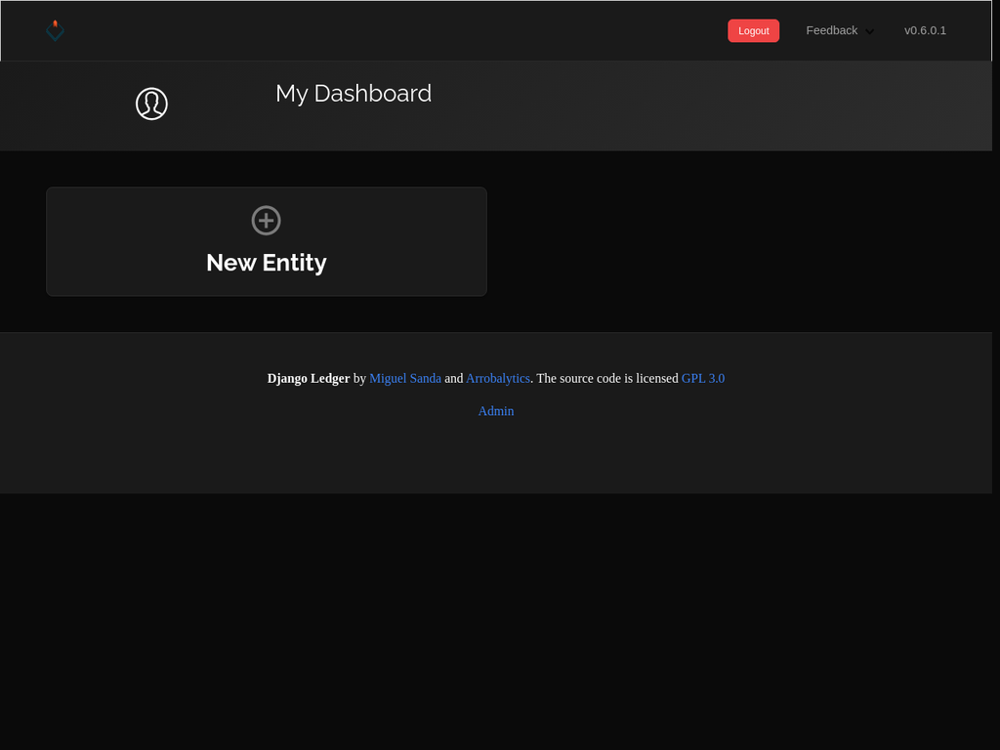
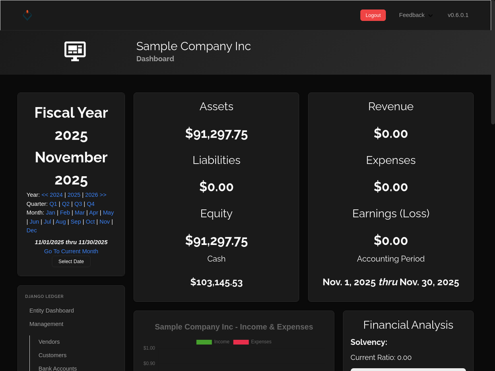
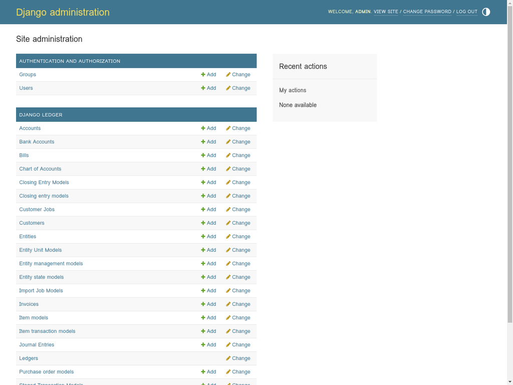
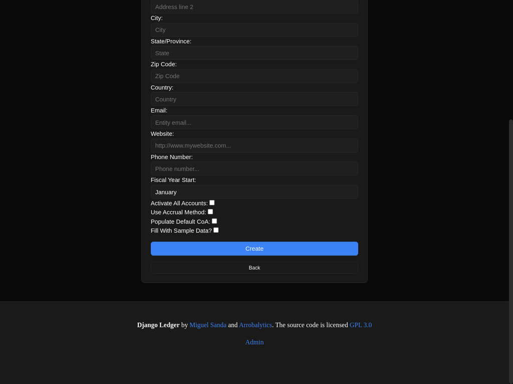

# Django Ledger - Dark Theme Edition

A modern, dark-themed accounting system built with Django, featuring a shadcn/ui-inspired design.



## 🌙 Features

### Dark Theme
- **Global dark theme** applied to all pages (frontend + admin)
- **shadcn/ui-inspired design** with modern aesthetics
- **High contrast** for excellent readability
- **Consistent styling** across the entire application

### Complete Accounting System
- **Entity Management** - Multi-entity support
- **Chart of Accounts** - 95 pre-configured accounts
- **Invoicing** - Create and manage invoices
- **Bills & Expenses** - Track payables
- **Customers & Vendors** - Contact management
- **Bank Accounts** - Banking integration
- **Financial Reports** - Balance Sheet, Income Statement, Cash Flow
- **Journal Entries** - Double-entry bookkeeping
- **Purchase Orders** - Procurement management
- **Estimates & Contracts** - Project quoting

### Admin Interface
- **23 models** fully accessible in Django admin
- **Dark theme** applied to admin interface
- **Full CRUD operations** for all models
- **Search & filtering** capabilities
- **Bulk actions** for efficiency

## 🚀 Quick Start

### Prerequisites
- Python 3.11+
- pip

### Installation

1. **Clone the repository**
```bash
git clone https://github.com/YOUR_USERNAME/ACCOUNTS.git
cd ACCOUNTS
```

2. **Install dependencies**
```bash
pip install -r requirements.txt
```

3. **Run migrations**
```bash
python manage.py migrate
```

4. **Create superuser**
```bash
python manage.py createsuperuser
```

5. **Collect static files**
```bash
python manage.py collectstatic --noinput
```

6. **Run development server**
```bash
python manage.py runserver
```

Visit `http://localhost:8000` to see the application.

### Production Deployment

For production deployment with Gunicorn:

```bash
chmod +x start-production-improved.sh
./start-production-improved.sh
```

## 🎨 Dark Theme

The dark theme is implemented using custom CSS and applied globally via the base template.

### Color Palette
- **Background**: #0a0a0a (black)
- **Cards**: #1a1a1a (dark gray)
- **Borders**: #2a2a2a
- **Text Primary**: #ffffff (white)
- **Text Secondary**: #a1a1a1 (light gray)
- **Accent Blue**: #3b82f6
- **Accent Green**: #10b981
- **Accent Red**: #ef4444

### Customization

To modify the dark theme, edit:
```
django_ledger/static/dark-theme.css
```

After making changes, collect static files:
```bash
python manage.py collectstatic --noinput
```

## 📊 Features Overview

### Dashboard
- Financial metrics and KPIs
- Entity management
- Quick access to common tasks
- Financial analysis charts

### Entity Dashboard
- Assets, Liabilities, Equity overview
- Revenue and Expenses tracking
- Cash flow monitoring
- Financial ratios (ROE, ROA, Profit Margins)
- Period selection (Year, Quarter, Month)

### Admin Interface
All Django Ledger models are accessible:
- Accounts
- Bank Accounts
- Bills
- Chart of Accounts
- Closing Entries
- Customers
- Entities
- Invoices
- Items & Inventory
- Journal Entries
- Ledgers
- Purchase Orders
- Transactions
- Vendors
- And more...

## 🛠️ Technology Stack

- **Backend**: Django 5.2.7
- **Database**: SQLite3 (PostgreSQL-ready)
- **WSGI Server**: Gunicorn (production)
- **Static Files**: WhiteNoise
- **Frontend**: HTML, CSS, JavaScript
- **Charts**: Chart.js
- **Python**: 3.11

## 📁 Project Structure

```
ACCOUNTS/
├── django_ledger/          # Main Django app
│   ├── admin/             # Admin configurations
│   ├── models/            # Database models
│   ├── static/            # Static files (CSS, JS)
│   ├── templates/         # HTML templates
│   └── views/             # View logic
├── dev_env/               # Project settings
├── staticfiles/           # Collected static files
├── db.sqlite3            # Database
├── manage.py             # Django management script
├── requirements.txt      # Python dependencies
└── start-production-improved.sh  # Production startup script
```

## 🔐 Default Credentials

After creating a superuser, you can access:

- **Admin Interface**: `/admin/`
- **Main Application**: `/`

## 📝 Sample Data

To populate the database with sample data:

1. Create an entity via the web interface
2. Check "Fill With Sample Data" when creating
3. Also check "Activate All Accounts" and "Populate Default CoA"

This will create:
- 95 accounts in the chart of accounts
- 50 sample invoices
- Sample customers and vendors
- Sample transactions

## 🌐 Deployment

### Development
```bash
python manage.py runserver
```

### Production (Gunicorn)
```bash
./start-production-improved.sh
```

### Environment Variables
Create a `.env` file for sensitive settings:
```
SECRET_KEY=your-secret-key
DEBUG=False
ALLOWED_HOSTS=your-domain.com
DATABASE_URL=your-database-url
```

## 📖 Documentation

- **Django Ledger Docs**: Original project documentation
- **Dark Theme Guide**: See `DARK_THEME_README.md`
- **Deployment Guide**: See `DEPLOYMENT_GUIDE.md`
- **Admin Setup**: See `ADMIN_RESTORATION_COMPLETE.md`

## 🤝 Contributing

This is a customized version of Django Ledger with a dark theme applied. For the original project, visit:
https://github.com/arrobalytics/django-ledger

## 📄 License

GPL 3.0 - Same as the original Django Ledger project

## 🙏 Credits

- **Original Project**: [Django Ledger](https://github.com/arrobalytics/django-ledger) by Miguel Sanda
- **Dark Theme**: Custom implementation inspired by shadcn/ui
- **Customization**: Manus AI

## 📸 Screenshots

### Main Dashboard


### Entity Dashboard


### Admin Interface


### Forms


## 🐛 Issues & Support

For issues related to:
- **Dark theme**: Open an issue in this repository
- **Django Ledger core**: Visit the [original project](https://github.com/arrobalytics/django-ledger)

## ⭐ Star This Repo

If you find this dark theme useful, please star the repository!

---

**Made with ❤️ using Django and shadcn/ui design principles**
